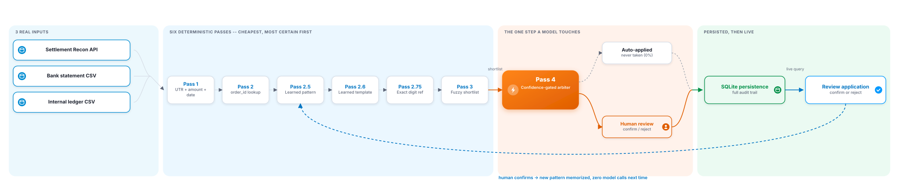
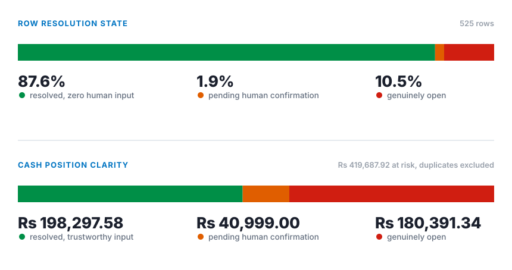
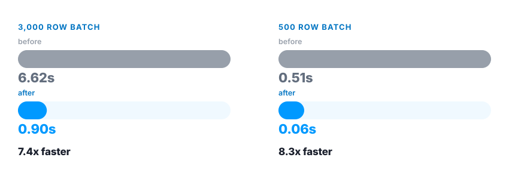

# Settlement Reconciliation Engine

[](https://github.com/niy-ati/recon-engine/actions/workflows/test.yml)
[](#setup)
[](LICENSE)
[](#ai-usage-and-validation)

A reconciliation system for Razorpay merchants that matches settlement, bank, and ledger records, resolves what it can prove deterministically, and only reaches for a narrowly scoped, confidence-gated AI layer when deterministic logic can't resolve a row. Everything else goes to a human, with a full audit trail explaining why it didn't resolve on its own.

**Governing principle:** every action traces back to a verifiable rule, a verifiable data field, or a human decision. Nothing is inferred or shown as resolved unless the data proves it. Every accuracy claim here is measured on the full batch and backed by a 5-seed sweep (`extras/seed_sweep.py`) and a persisted evaluation harness (`src/arbiter_eval.py`), never one cherry-picked example.

Reconciliation isn't a hypothetical line item. A real Razorpay hotel-payments customer reports that automatic reconciliation cut booking cancellations from 18% to 5%, cut payment failures by 40%, and saved staff 15 hours a week. ([Source](https://www.linkedin.com/posts/aeijaz-sodawala-a2202a64_hoteltech-hospitalitytechnology-payments-share-7500577134541713408-vsug/)) That's the exact kind of manual-matching time this system exists to eliminate.

**Live demo:** [reconcile-engine-demo.vercel.app](https://reconcile-engine-demo.vercel.app), the real review dashboard and Settlement Q&A, running against a persisted batch.
**Video, screenshots:** [Google Drive folder](https://drive.google.com/drive/folders/1OBS8dvLnuLHjImn6XZF13Ev96iextn2g?usp=sharing)

## At a glance

- **87.6% resolved with zero human input**, versus roughly 51% for manual spreadsheet reconciliation. Measured on a real 525-row batch, holding 86 to 88% across five other untuned batches.
- **9 named exception categories**, including `DISPUTED`, which exists precisely because it's the reason this number isn't higher: a settlement with an active dispute used to count as a plain clean match. It doesn't anymore, on purpose. See [Exception Categories](#exception-categories).
- **7-pass deterministic matcher**: UTR, order ID, learned patterns, exact digit references, fuzzy narrowing, all before a model is ever consulted.
- **One AI step, tightly gated**: a model picks between candidates a deterministic pass already shortlisted, at 90%+ confidence, and only auto-applies from a trust list that's empty until a tier proves itself. Nothing has ever auto-applied.
- **Full audit trail**: every automatic and human decision is a real, replayable SQLite record.
- **Live dashboard**: Overview, Queue, Records, Sources, with real charts computed from the batch, not screenshots.
- **Settlement Q&A**: ask plain-language questions about a batch by chat, voice, or an uploaded statement or photo. Retrieval only, never generated.
- **Hands-free Voice Agent**: listens, answers out loud, and can be interrupted mid-answer, entirely in-browser.
- **Real Razorpay connection**: authenticated and fired against the live Settlement Recon API, not just built and left unexercised.
- **Zero paid API keys anywhere.** The only model used, Ollama, runs locally.
- **Tax line matcher**: checks every settlement's GST against the real statutory rate, independent of matching. Found live: 10 rows the reconciliation itself calls clean are still charging the wrong GST.
- **Forward cash forecast**: not a second Cashflow Forecaster. Projects exactly how much cash unlocks the moment the queue's already-computed matches get confirmed.

## Table of Contents

- [Architecture](#architecture)
- [Reconciliation Passes](#reconciliation-passes)
- [Exception Categories](#exception-categories)
- [Metrics](#metrics)
- [Performance](#performance)
- [AI Usage and Validation](#ai-usage-and-validation)
- [Failure Recovery](#failure-recovery)
- [Live Razorpay Integration](#live-razorpay-integration)
- [Compared to Razorpay's Own Reconciliation Agent](#compared-to-razorpays-own-reconciliation-agent)
- [Review Application](#review-application)
- [Settlement Q&A](#settlement-qa)
- [Tax Line Matcher](#tax-line-matcher)
- [Forward Cash Forecast](#forward-cash-forecast)
- [Scope](#scope)
- [Setup](#setup)
- [Testing](#testing)
- [License](#license)

## Architecture



The validation gate lives in its own module, separate from both the matching engine and the model-calling logic. **The reconciliation engine has no import path to raw model output**, enforced by an automated test. Every proposed match, deterministic or AI-proposed, passes through the same gate before it counts as resolved.

## Reconciliation Passes

Cheapest and most certain first. A row never reaches a more expensive pass once an earlier one has resolved it.

| Pass | Matches on | Needs a model |
|---|---|---|
| 1: Settlement to Bank | UTR, amount, value date | No |
| 2: Settlement to Ledger | `order_id` | No |
| 2.5: Learned Pattern | A narration a human already confirmed, exact string | No |
| 2.6: Learned Template | A different order's narration from the same recurring template | No |
| 2.75: Exact Digit Reference | An unambiguous order number inside free text | No |
| 3: Fuzzy Candidate Narrowing | Sequence similarity, builds a shortlist only | No |
| 4: Confidence-Gated Arbiter | A model picks one candidate off that shortlist | **Yes, the only pass that does** |

**Three things worth knowing about how these behave:**

- **Pass 1 catches a real, underdocumented Razorpay quirk**: a settlement's batch-level UTR and its per-order [recon-line UTR](https://razorpay.com/docs/api/settlements/fetch-recon/) can genuinely diverge for the same transfer. When that happens, Pass 1 checks every other unclaimed bank row for an exact amount-and-date match under a different UTR, and only resolves it when exactly one such row exists. Two or more candidates stays unresolved rather than getting guessed at.
- **Pass 2.5 can't be poisoned by a lazy confirmation.** A narration only gets memorized for future auto-resolution if it contains a numeric reference unique to that order. A generic "payment received, thank you" still resolves the row in front of the reviewer; it just never enters the pattern store.
- **Pass 4 can't introduce a candidate of its own.** It's restricted to the 1 to 3 orders Pass 3 already shortlisted. It selects, it doesn't originate.

## Exception Categories

Every unmatched row gets a specific, named category and a stated reason, not a generic failure flag.

| Category | Trigger | What it means |
|---|---|---|
| `ROUNDING` | Bank credit off by less than one rupee | Sub-rupee GST-on-MDR drift. **No action needed.** |
| `TAX_DEDUCTION` | Ledger GST differs from the settlement report | **Check against Razorpay's monthly tax invoice.** |
| `PARTIAL_PAYMENT` | Ledger shows a refund netted into the settlement | Settled amount is gross minus refund. **Not a mismatch.** |
| `UTR_LEVEL_MISMATCH` | Bank credit matches amount/date under a different, unclaimed UTR | **The money arrived**, only the reference diverged. |
| `DUPLICATE` | A settlement ID appears twice, one bank credit exists | **The real money already cleared** under the sibling entry. |
| `ON_HOLD_BY_RAZORPAY` | Recon line reports `on_hold: true` | Razorpay is **deliberately holding** the payout. |
| `AFA_MANDATE_HOLD` | Subscription renewal above the RBI [₹15,000 e-mandate threshold](https://www.business-standard.com/amp/article/finance/new-e-mandate-guidelines-rbi-enhances-limit-for-e-mandates-on-credit-debit-cards-to-rs-15-000-122060800417_1.html) | Needs a **compliant step-up re-auth**, not a blind retry. |
| `FUZZY_MATCH_NEEDS_REVIEW` | Arbiter proposed a candidate, didn't clear the trust gate | A ranked candidate exists, **one click** confirms or rejects. |
| `UNEXPLAINED` | No counterpart anywhere after every pass runs | Genuinely unexplained. **Expected to stay above zero**, a perfect match rate is a red flag, not a win. |
| `DISPUTED` | Settlement recon line carries an active `dispute_id` | The bank credit can still look clean. **Don't treat it as booked** until the dispute resolves. |

`DISPUTED` is the newest category, and the reason the headline resolved percentage is lower than it used to be: a disputed settlement with an otherwise clean bank match used to count as plain `MATCHED`. It shouldn't have, the money can still be clawed back, so it no longer does. See [AI Usage and Validation](#ai-usage-and-validation) for what this cost the number, on purpose.

## Metrics

- **87.6% resolved, zero human input**, on a 525-row batch. Re-run against five other untuned seeds: **86.4% to 88.4%**, every one clear of the roughly 51% manual baseline by 35+ points. `python extras/seed_sweep.py` reproduces this live.
- **95.3 rows per second throughput**, 525 rows in 5.51 seconds, including the one LLM call the batch actually needs.
- A row the arbiter *proposed* but nobody confirmed is never counted as resolved. Duplicate rows are excluded from cash figures entirely, since that money already cleared under its sibling row.



## Performance

- **5.51 seconds end to end for the full 525-row batch** (95.3 rows/sec), including the one LLM call the batch actually needs. Pass 1 through 2.75 alone clear in well under a second.
- **Persistence reads every learned pattern and match index once per batch**, not once per row, via a bulk read plus two dictionary indexes. A 3,000-row stress batch runs in 0.9 seconds and holds at 3.3 seconds even at 6,000 rows, 12x the demo batch size, with byte-identical output at every scale.
- **The Ollama client connects over the literal loopback address, not the hostname.** On Windows, resolving `localhost` tries IPv6 first and only falls back to IPv4 after a real timeout, adding measurable latency to every single call.



## AI Usage and Validation

- **Used in exactly one place**: Pass 4, choosing between candidates a deterministic pass already shortlisted. It never invents a category, never decides whether a row is resolved, and never sees a candidate it didn't receive from the deterministic layer.
- **One model tier, local and free.** No paid API, no dependency on any account balance.
- **Adversarially tested, and it failed the test.** Given a narration with no genuine identifying signal and two equally plausible candidates, it picked whichever came first and reported over 90% confidence anyway, a reproducible positional-bias failure.
- **Result: the trust list is empty by design.** No row in any real batch has ever been auto-applied. Confidence is still recorded and still routes to human review; it's just never treated as sufficient on its own.
- **A second, independent test looked for a case where trusting it would've been right, and didn't find one.** [`src/ai_judgment_demo.py`](src/ai_judgment_demo.py): a narration naming two orders in one sentence, only one actually paid. Three framings, real model: two picked the wrong order outright, the third gave the right answer for an incoherent reason.

**The gate is layered, not a single confidence check.** Each row is real, tested, and named:

| # | Check |
|---|---|
| 1 | A ledger row only becomes a Pass 4 candidate if no earlier, cheaper pass already claimed it |
| 2 | The shortlist shown to the model is capped at 3 lookalikes, never the whole batch |
| 3 | A malformed model response is rejected outright |
| 4 | A candidate the model names that wasn't in its own shortlist is rejected as untrusted |
| 5 | Confidence must clear 90% |
| 6 | The tier that produced it must be on an explicit, empty-by-design trust list |
| 7 | The candidate's own settlement amount must agree with the ledger row's amount within a sane tolerance, even after every other check passes |
| 8 | Once a ledger row is claimed, it can never be handed to a second settlement row in the same run |

**That evidence is now a persisted, re-runnable harness, not just a comment.** [`src/arbiter_eval.py`](src/arbiter_eval.py) is modeled on Razorpay's own published evaluation philosophy: reject contaminated public benchmarks, build a small domain-specific harness instead, store raw results so a re-score never needs another model call, re-evaluate whenever the model changes rather than trust one frozen finding forever. ([Source](https://razorpay.com/blog/the-winner-doesnt-take-it-all)) Running `python src/arbiter_eval.py` replays the positional-bias case, the context-judgment case, and a plain OCR-typo case fresh, and writes both the raw per-case JSON and a markdown report to `eval/`. Last real run against `qwen2.5:0.5b`: 50% accuracy on the two cases with a real answer, mean confidence 1.0 when correct versus 0.0 when wrong (not the well-calibrated pattern that would make confidence trustworthy), and the ambiguous no-signal case still came back at roughly 100% confidence, the same positional-bias failure, reproduced live.

**The governance is a real file, not a policy doc.** [`agent_manifest.json`](agent_manifest.json) states exactly what the agent reads and writes, every action it can and can't take, and what a human can revoke, machine-readable, not prose.

**This isn't an isolated position.** Four separate teams, four different problems, converged on the same rule: a model proposes, a deterministic layer or a human decides.

| Project | Problem | Restraint mechanism |
|---|---|---|
| This system | Settlement reconciliation | 8-layer gate, trust list empty |
| [PayScope](https://github.com/Drix10/payscope) | Payment-failure recovery | Deterministic policy engine, explicit safety gates, immutable audit trail |
| [RazorRecover AI](https://www.linkedin.com/posts/sanjeev-kumar-1803t_fintech-ai-generativeai-ugcPost-7499528485238132736-xmNA/) | Revenue recovery | 9-rule deterministic policy engine, the model reasons but never decides alone |
| [VETO](https://www.linkedin.com/posts/jslxh_ai-agenticai-aiagents-ugcPost-7500041420758470656-OcsU/) | Checkout upselling | Built around *declining* to act, 56% of its own upsell offers withheld on purpose |

Razorpay's own stated AI direction is the opposite extreme, deliberately, and it reaches the same conclusion about trust. [Vulcan](https://www.linkedin.com/posts/razorpay_razorpay-artificialintelligence-fintech-activity-7498631537492508672-kwEe), their proprietary foundation model (about 4 billion transactions, roughly 3 trillion data points, built with NVIDIA and AWS), unifies routing, fraud, and risk into one model at a scale no local model or small team could reproduce, and rightly so for that job. But by their own account it shipped through a **shadow-mode phase**, silently scored against live traffic before it was ever allowed to act, and even in production it issues **"recommendations, not autonomous decisions"** under stated mathematical guardrails. A model that size, trained on that much real data, still doesn't get to decide on its own. This system's own empty `AUTO_APPLY_TRUSTED_TIERS` is the same call, made at a scale a small local model has to earn from zero, not from 4 billion transactions of track record.

## Failure Recovery

- Ollama unreachable falls through to a labeled deterministic stand-in, verified by substituting the network call with one that actually fails.
- Live Razorpay API call retries with exponential backoff on a network error, verified against a transport that fails twice before succeeding.
- An adversarial UTR-collision trap (two settlements, identical amount, different UTR) runs on every standard batch and resolves both correctly. The matcher can't cross-wire two customers' payments. See [`src/failure_injection_demo.py`](src/failure_injection_demo.py).
- Confirm and reject writes on the review server are guarded against a race on its `ThreadingHTTPServer`: a conditional update means only the first decision on a row is ever applied, regression-tested against the unguarded behavior.
- The validation sweep's timeout sits above Ollama's own documented cold-load ceiling (about 80 seconds), so a slow first call across five seeds doesn't read as a hang. See [`extras/seed_sweep.py`](extras/seed_sweep.py).

## Live Razorpay Integration

The connection to Razorpay's [Settlement Recon API](https://razorpay.com/docs/api/settlements/fetch-recon/) **is authenticated and has actually been fired against real test-mode credentials**, not just built and left unexercised. Test mode correctly returns zero settlements (no real money moves in test mode), and the system reports that as the expected result, not an error. The call retries with exponential backoff on a network failure, verified against a transport substituted to fail twice before succeeding.

Independently cross-checked against Razorpay's own official [`razorpay-cli`](https://github.com/razorpay/razorpay-cli) (its `settlements recon` command, [source](https://github.com/razorpay/razorpay-cli/blob/master/cmd/settlements/recon.go)): the endpoint (`GET /v1/settlements/recon/combined`) and the year/month/day query parameters `fetch_live_recon()` in [`src/ingest.py`](src/ingest.py) uses are identical to Razorpay's own tool, not just to the docs page.

## Compared to Razorpay's Own Reconciliation Agent

Razorpay's own [Intelligent Reconciliation Agent](https://razorpay.com/blog/razorpay-agentic-platform/) is real and shipped, in their own words: "upload a screenshot of your bank statement. The agent extracts UTR numbers and amounts instantly, cross-referencing them against Razorpay records to flag discrepancies." Two sources, ending at "flag a discrepancy." The same claim was repeated at their FTX'26 Agent Studio launch: "match this with my Razorpay settlements...reads the file, finds payment details, and matches them instantly. What once took finance teams hours of manual work can now be done in seconds." ([Source](https://razorpay.com/newsroom/razorpay-launches-the-worlds-first-ai-native-agent-studio-for-payments-at-ftx26-powered-by-anthropics-claude/)) Still two sources, still stopping at a match, not a taxonomy.

**What this adds:** a third source (the merchant's own ledger), a named exception taxonomy, a confidence-gated AI layer, and a loop where a human correction generalizes to the next similarly worded row. [`src/three_source_advantage_demo.py`](src/three_source_advantage_demo.py) proves the third source matters against the real batch: **65 of 523 rows (12.4%) are resolved or explained only because the ledger got read**, including 3 rows with a perfectly clean UTR, amount, and date match that a two-source tool would call done, which this system still flags because the merchant's own ledger has no record of the order at all.

The same gap holds even for Razorpay's own multi-gateway product. [Optimizer's Single View Recon](https://razorpay.com/blog/single-view-recon/) consolidates settlements across payment gateways into one dashboard, but it's a consolidated view, not a matching engine: no AI matching, no exception taxonomy, no merchant ledger as a source, and it only works on payments already routed through Optimizer.

Multi-gateway isn't a hypothetical. On a 100,000-orders-in-a-day sale, [Pilgrim's founder posted publicly](https://www.linkedin.com/posts/pritish-vartak_100000-orders-in-a-single-day-our-biggest-activity-7499412466506829824-YCaU) that their primary processor went down mid-day and Razorpay handled the diverted traffic as backup, one merchant, one day, settlement data now structurally spanning two gateways. [`src/generic_gateway_adapter.py`](src/generic_gateway_adapter.py) and [`src/demo_gateway_agnostic.py`](src/demo_gateway_agnostic.py) prove the exact matching logic above (Pass 1/2, zero code changes) resolves settlements from a second, completely differently-shaped export the same way, a generic stand-in for gateway heterogeneity, not a specific competitor's real format, and not a confirmed Razorpay gap, just what this build already does with a real, dated example of why it'd matter.

## Review Application

Four pages, one stdlib `http.server`, no framework: **Overview**, **Queue**, **Records**, **Sources**, sharing one shell and one live SQLite database with the pipeline. Razorpay's own [Agent Studio](https://www.linkedin.com/posts/razorpay_razorpay-agentstudio-activity-7492897315595177985-tLWY) names the same shape it's built toward, a "My Agents Tab" it calls a "unified command center" for monitoring automated workflows instead of tracking them by hand. Overview and Queue below are that same idea applied to this system's own output: one place to see what needs a decision and why, not a log to page through.

- **Overview**: a donut chart of the real status breakdown, a three-bucket bar showing how rarely the AI pass is actually needed, a category grid linking straight to filtered rows, a cash-value-by-category chart (a category with few rows can still hold the most money), an open-exceptions-by-materiality chart (a Rs.50,000 open row and a Rs.50 one land in different buckets, not the same visual weight), and the cash-position clarity panel from [Metrics](#metrics).
- **Queue**: every row still needing a decision, full `replay_log` per row, Confirm / Reject / Needs-clarification actions writing straight to SQLite.
- **Records**: every persisted row, filterable and sortable entirely client-side.
- **Sources**: the three raw input files with row counts, to trace a result back to its export, plus the **tax line audit** below them (see [Tax Line Matcher](#tax-line-matcher)).

## Settlement Q&A

Plain-language questions about the batch, answered by [`src/settlement_qa.py`](src/settlement_qa.py): **retrieval from the real persisted data, not a model's guess.** A question outside what it recognizes gets an honest "I don't have a way to answer that," never a guess. It can't take an action either; confirming or rejecting still goes through the review queue's own buttons. One exception, deliberately gated: see "A narrated version" below.

This is the same direction Razorpay's own CEO has staked the company's dashboard strategy on: "the best interface may not be a better dashboard, it may be no dashboard at all... less navigation, less learning where things are, more intent to outcome." ([Harshil Mathur](https://www.linkedin.com/posts/harshilmathur_the-best-dashboard-might-be-no-dashboard-ugcPost-7500452436390596608-JI_k/), on their own Agentic Dashboard's first 20 weeks: 7.8x growth in weekly queries, 5.3x growth in new merchants per week.) The real critique that post's own comments raised, that a dashboard still earns its keep for surfacing an anomaly nobody thought to ask about, and that a system asking for trust owes real transparency into what it's reading, is exactly why this project ships **both**, not one instead of the other. The full Overview/Queue/Records audit trail keeps working for browsing and surfacing the unexpected, and every chat/voice answer is grounded in that same persisted data, down to which pass resolved a row and why, never a summary that hides what it's actually built on.

**What you can ask:**

- **A specific order or settlement**: "what happened to order_1032," "what happened to setl_a1b2c3."
- **A category**: count or list, "how many DUPLICATE exceptions," "list DUPLICATE orders."
- **Status and resolution**: "what's my resolution rate," "how many have been confirmed/rejected," "how many rows need clarification."
- **The whole batch, not just one order**: "give me an overview of this batch," "what's the status breakdown," "how many settlements are in this batch," "what's the total settlement value," "what's the biggest exception."
- **A settlement by date, and when the next one lands**: "settlement on the 5th," "what settled on august 5th" returns the real UTR and gross/MDR/GST/net breakdown for that day, resolved against this batch's own real `settlement_date` values, never a guessed date. "When's my next settlement" is deliberately *not* a time-series prediction, same reasoning as [Forward Cash Forecast](#forward-cash-forecast) below. It reports the real most-recent settlement in the batch, any amount currently `ON_HOLD_BY_RAZORPAY`, and Razorpay's own stated T+2 cycle.
- **Cash position**: "how much money is in UNEXPLAINED," "what's my cash position" (reuses the exact function the Overview page's own cash panel uses, never a second, independent calculation).
- **Follow-ups and related cases**: "how can it be resolved," "what can I do meanwhile," "will it affect my cash flow," "any similar orders to order_1032," all resolve against whichever order or category the conversation was already about.
- **The system itself**: "why isn't this just an LLM," "what model do you use," "what's the architecture," "what's your accuracy." Fixed, human-written answers, not generated ones.
- **Plain fintech vocabulary**: "what is a UTR," "what does chargeback mean," "what is AFA," "what is an audit trail." Fixed definitions, not this batch's own numbers, so there's nothing here to hallucinate.
- **Ordinary conversation**: a greeting, thanks, goodbye, "how are you," "what can you do," or a bare "ok"/"sure" all get a real, warm, human-written reply instead of the honest-but-cold fallback below, checked before anything else, so the first thing said to the voice agent is never a refusal.
- **A narrated version, in plain English**: "narrate this batch," "give me a written summary," "tell me a story about this batch." The one place a model *writes* an answer instead of retrieving one: Ollama receives only the same already-computed, verified numbers the deterministic overview uses, never raw rows, and every number in its response is extracted and checked against those exact facts before ever being shown. One invented number and the whole response is discarded for the plain deterministic version instead, tested live, not just claimed.
- **Whether an open row is a one-off or systemic**: "is there a recurring pattern in the exceptions," "any systemic issues here." Groups every currently-open row by a generalized narration shape. Found live on the real batch: all 14 open `FUZZY_MATCH_NEEDS_REVIEW` rows share the exact same shape, one narration template consistently misreading a digit as a letter, not 14 unrelated typos.
- **Whether tax was charged correctly**: "check tax rates," "any tax errors," "is the GST correct." See [Tax Line Matcher](#tax-line-matcher) below.

**How you can ask it:**

- **Chat**: type it, or upload a PDF or photo of a statement; it finds the order/settlement ID and answers about it. Every chat answer can be read back aloud.
- **Voice Agent**: a separate, persistent, hands-free widget on every page. It listens, answers out loud, and starts listening again automatically, no mic button to click each turn. **It can be interrupted mid-answer**: while it's speaking, it listens in the background and stops the instant it hears words that aren't just its own voice echoing back through the speakers, rather than relying on raw volume, which can't tell an echo from a real interruption. Razorpay's own [Payment Recovery voice agent](https://www.linkedin.com/posts/razorpay_razorpay-activity-7485926025374294016-aG6r) (lending, TPV failures) validates the same pattern this Voice Agent already uses in a different domain: explain what happened in plain language and guide the next step out loud, at the moment it's needed, instead of a person chasing a dashboard.
- Every question above works identically by voice, however a person actually phrases it, apostrophe or not, "whats" or "what's."

**Voice output tries [Kokoro](https://huggingface.co/posts/Xenova/503648859052804) first**, a real 82M-parameter neural voice that runs entirely client-side via WASM (MIT licensed, zero cost, nothing leaves the browser). This is a strict progressive enhancement, not a replacement: every failure mode (network, WASM, an unexpected API shape) is caught and falls straight back to the browser's own built-in speech, exactly as it worked before.

**Everything here runs local, no cloud API, no key, no cost**, for the chat, the voice, or the document upload, the same principle Razorpay's own Agent Studio states as a hard guarantee for its own agents: "agents operate entirely within Razorpay's infrastructure; merchant data never leaves systems." ([Source](https://razorpay.com/blog/razorpay-agent-studio-principles-guardrails-and-merchant-control/)) A gated model fallback exists underneath for phrasing the keyword matching doesn't recognize, same confidence-gate discipline as the reconciliation engine's own Pass 4, held untrusted for the same reason.

## Tax Line Matcher

A named use case in its own right, separate from reconciliation. Matching settlement, bank, and ledger amounts against each other says nothing about whether the tax on those amounts is *correct*. [`src/tax_audit.py`](src/tax_audit.py) checks every settlement's GST-on-MDR against the real, current statutory rate: **18%** of the MDR fee, not of the transaction's gross value ([source](https://razorpay.com/blog/enterprise-payment-gateway-pricing-india/)).

Found live on this project's own real 509-row batch: **10 settlements** (`order_1058`, `order_1128`, and 8 others) are currently plain `MATCHED` rows with no exception at all, clean by every check reconciliation runs, and clean by a dashboard that only compares settlement to ledger, yet every one was charged Rs.1 more GST than the law requires. Their settlement and ledger figures agree with each other; they just both agree on the wrong number, exactly the case a pure amount-matching check can never catch.

**A second, distinct tier**, because RazorpayX itself ships one for real: [Manage Teams to Billing](https://razorpay.com/docs/x/manage-teams/billing/) describes a transaction-level **Invoice Reconciliation Report** and a consolidated **Monthly Tax Invoice Report** a GST-registered merchant reconciles against before filing ITC, two different reports because they genuinely catch different things. `audit_monthly_reconciliation()` mirrors the second tier: it sums a month's actual GST-on-MDR against what the real 18% rate should produce in aggregate.

Found live on the same batch: the month's real aggregate drift is **Rs.9.83**, and the ten known per-row overcharges already sum to **Rs.10.00** on their own, a Rs.0.17 residual, well inside ordinary rounding noise. This run, the two tiers confirm each other: the per-row check already accounts for essentially the whole month's drift. A different seed can flip this the other way (per-row under-explaining the aggregate, revealing sub-tolerance drift spread across the rest of the month, each row individually inside this project's own Rs.0.50 tolerance, already tighter than the GST-reconciliation industry's own common ±Rs.1 convention, per [ClearTax](https://cleartax.in/s/gst-reconciliation)), both are real outcomes this second tier can surface, not a gap a per-row check alone could ever see either way.

Shown on the **Sources** page, and answerable directly, "check tax rates" for the per-row tier, "is the monthly tax invoice reconciled" for the aggregate one, through the same Settlement Q&A path as everything else.

## Forward Cash Forecast

Razorpay already ships a real, production Cashflow Forecaster, a time-series prediction over transaction history. This is deliberately **not** a second one: a genuine forward prediction needs a history of past resolution times this project has no honest way to claim, so it doesn't claim one.

What it answers instead is a different, fully honest question: not *when* will this resolve, but *how much unlocks the moment someone acts on what's already been verified*. `db.compute_cash_clarity()`'s `pending_review` figure is exactly that, cash sitting on a match this engine has already computed and proposed, waiting only on a human's confirm, not on new information. Projecting it forward is arithmetic over real, already-computed numbers, not a guess about the future.

On the real batch: confirming everything currently in the queue moves resolved cash from **47.2% to 57.0%**, an extra **Rs.40,999.00** unlocked with zero new matching work. The remaining still-open cash has no proposed match yet, and is disclosed as exactly that rather than forecast forward without new information.

Shown on the **Overview** page, right under Cash-position clarity, and answerable directly, "forecast my cash," "what if I confirm everything," through Settlement Q&A.

## Scope

### In Scope

Reconciliation of settlement, bank, and ledger data for a single direct-to-consumer merchant on Razorpay, using either the live Settlement Recon API or an equivalent CSV export. Nine named exception categories. A complete, replayable audit trail for every automatic or human decision.

### Out of Scope

- **A dedicated TCS or TDS (Section 194-O) matcher.** Razorpay's real recon API exposes [no such field](https://razorpay.com/docs/api/settlements/fetch-recon/), and [194-O liability is conditional on which party makes the final payment](https://razorpay.com/learn/section-194o-tds-for-e-commerce-businesses/), a legal determination, not something readable off a settlement line. Independently corroborated by [Terra Insight](https://www.terra-insight.com/insights/razorpay-settlement-reconciliation/). Razorpay's own [RazorpayX Agentic Banking](https://razorpay.com/agentic-business-banking/) roadmap lists a Tax Payments Agent for exactly this (TDS calculations) as **upcoming, not shipped**, this project doesn't attempt to build that ahead of Razorpay's own team. What IS in scope and built, see [Tax Line Matcher](#tax-line-matcher), is GST-on-MDR, a different tax with none of that ambiguity: a fixed 18% of a field every settlement already carries, no external legal fact needed.
- **A second, predictive Cashflow Forecaster.** Razorpay's own ships time-series prediction over transaction history; this system has no such history to honestly draw on. What it does instead, see [Forward Cash Forecast](#forward-cash-forecast), is a same-data projection: exactly how much of what's already stuck unlocks the moment a human confirms what's already been verified. A different kind of number, not a smaller version of the same one.
- **Bank and ledger integrations are synthetic.** No live bank or accounting-software API is connected. The settlement side has a real, fired connection, see [Live Razorpay Integration](#live-razorpay-integration).
- **The learned pattern store generalizes the digit reference, not arbitrary wording.** A genuinely different phrasing of the same event still needs a fresh confirm.
- **The review application is single-user, unauthenticated, local-only**, the right call for this scope, not a claim it's production-ready.

## Setup

### Requirements

Python 3.10+. The core, `reconcile.py`, `db.py`, `review_server.py`, `settlement_qa.py`, is zero-third-party-dependency, verified by parsing every import with Python's own `ast` module. Two optional layers need real packages (`requirements.txt`): the chat's document upload needs `pypdf` (required) and `pytesseract`/`Pillow` (optional OCR, degrades to an honest "not available" without the separate Tesseract engine); the separate Postgres-backed Vercel demo needs `psycopg`. Running `run_all.py` locally never touches either.

### 1. Clone and verify

```bash
git clone https://github.com/niy-ati/recon-engine.git
cd recon-engine
python --version
```

### 2. Run the synthetic pipeline

No credentials required.

```bash
python run_all.py
```

Generates a synthetic settlement, bank, and ledger dataset, runs every pass, persists results to SQLite, and prints the full report.

### 3. Start the review application

```bash
python src/review_server.py
```

Opens `http://localhost:8000`, backed directly by the database the previous step wrote.

### 4. Run the tests

```bash
python -m unittest discover -s tests -p "test_*.py"
```

CI runs this same command against Python 3.10 and 3.12 on every push.

### 5. Install Ollama for the arbiter pass

Skip this to leave Pass 4 on its labeled, low-confidence stand-in response, which still routes correctly to human review.

```bash
# macOS
brew install ollama

# Linux
curl -fsSL https://ollama.com/install.sh | sh

# Windows: download the installer from https://ollama.com/download
```

```bash
ollama pull qwen2.5:0.5b
```

Runs as a background service after install on macOS/Windows. On Linux, start it manually: `ollama serve`.

### 6. Connect the live Razorpay API

Skip this to stay on the synthetic dataset.

1. Create a Razorpay account at [razorpay.com](https://razorpay.com), test mode needs no KYC.
2. Switch to Test Mode in the Dashboard's top navigation.
3. Go to `Account & Settings` then `API Keys`, or [dashboard.razorpay.com/#/app/keys](https://dashboard.razorpay.com/#/app/keys).
4. Generate a test-mode key pair, the secret is shown once.
5. Copy `.env.example` to `.env` and set `RAZORPAY_KEY_ID`/`RAZORPAY_KEY_SECRET`. `.env` is gitignored.

```bash
python run_all.py --live
```

Test-mode credentials correctly return zero settlements, every row reports as an exception in this mode, which is expected, not a failure.

### 7. Install Tesseract for image uploads in chat

Skip this to leave document upload able to read PDFs, just not photos or screenshots, it says so honestly rather than failing silently.

```bash
# macOS
brew install tesseract

# Linux
sudo apt-get install tesseract-ocr

# Windows: download the installer from https://github.com/UB-Mannheim/tesseract/wiki
```

Everything stays local, no image, extracted text, or file ever leaves the machine.

## Testing

Covers the matching engine, persistence layer, validation gate, model-calling logic, live API retry-and-backoff behavior, and the review application's rendering logic. Network calls are substituted at the transport layer only, the decision logic under test always runs for real, against the substituted response.

## License

Released under the MIT License. See `LICENSE`.
